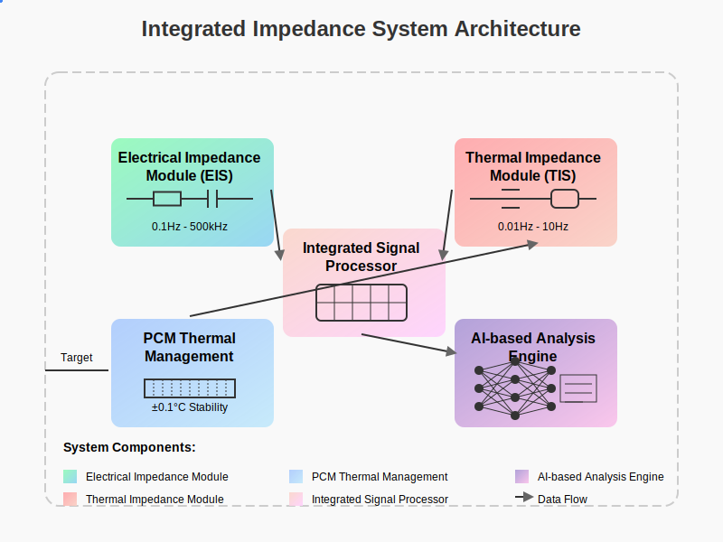
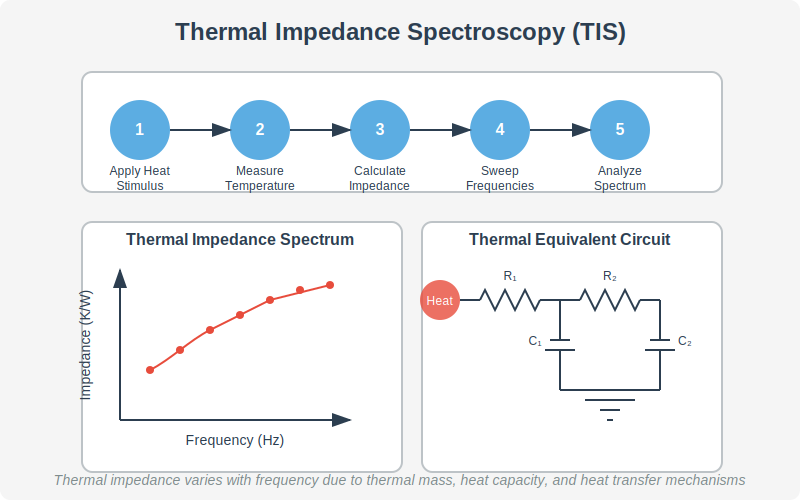
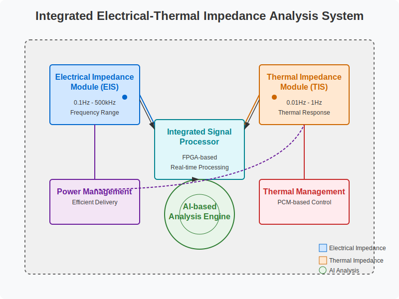

# Integrated Electrical-Thermal Impedance Analysis System

[](https://opensource.org/licenses/MIT)
[](https://www.python.org/)
[]()

## Overview

This repository contains an implementation of an advanced integrated electrical-thermal impedance analysis system. The system combines electrical impedance spectroscopy (EIS) and thermal impedance spectroscopy (TIS) techniques to provide comprehensive characterization of various systems including energy storage devices, semiconductor components, and biological tissues.



## Key Features

- **Integrated Measurement**: Simultaneous acquisition of electrical and thermal impedance data
- **Wide Frequency Range**: Supports measurements from 0.1Hz to 500kHz
- **AI-Based Analysis**: Deep learning models for impedance pattern recognition and system characterization
- **Thermal Management**: Precision thermal control using Phase Change Materials (PCM)
- **Multi-frequency Analysis**: Efficient data acquisition across multiple frequencies
- **Real-time Processing**: FPGA-based signal processing for real-time analysis
- **Adaptive Measurement**: Dynamic adjustment of measurement parameters based on system response

## Understanding Impedance Analysis

### What is Electrical Impedance?

Electrical impedance is a measure of opposition to alternating current (AC) flow in a circuit. Unlike resistance, which only applies to direct current (DC), impedance accounts for both magnitude and phase differences between voltage and current. It combines:

- **Resistance (R)**: Energy dissipation component
- **Reactance (X)**: Energy storage component (capacitive and inductive)

Electrical impedance is represented as a complex number:

```
Z = R + jX
```

Where:
- Z is the impedance (Ohms, Ω)
- R is the resistance (Ohms, Ω)
- X is the reactance (Ohms, Ω)
- j is the imaginary unit (√-1)

### What is Thermal Impedance?

Thermal impedance is a concept analogous to electrical impedance but applied to heat transfer. It describes how a material or system resists the flow of heat when subjected to a time-varying thermal stimulus.


Thermal impedance includes:

- **Thermal Resistance (R)**: Opposition to steady-state heat flow (K/W)
- **Thermal Capacitance (C)**: Ability to store thermal energy (J/K)
- **Thermal Mass Effects**: Analogous to inductance in electrical systems

Thermal impedance is frequency-dependent and provides insights into:
- Heat propagation dynamics
- Material thermal properties
- Interface thermal behavior
- Thermal management effectiveness

For a more detailed explanation of thermal impedance, see our [thermal impedance documentation](docs/thermal_impedance/README.md).


### Comparing Electrical and Thermal Impedance


### Thermal Impedance Spectroscopy (TIS)

Thermal Impedance Spectroscopy involves measuring thermal impedance across a range of frequencies to characterize a system's thermal response.



Key aspects of TIS:
1. Apply periodic thermal stimuli at different frequencies
2. Measure temperature response (amplitude and phase)
3. Calculate thermal impedance at each frequency
4. Analyze the resulting impedance spectrum
5. Model the system using thermal equivalent circuits

TIS reveals information that steady-state thermal measurements cannot provide, including:
- Thermal time constants
- Heat propagation pathways
- Thermal interface quality
- Structural defects
- Thermal capacitance distribution

Our implementation is based on the heat-pulse response analysis method described by Barsoukov et al. (2002). For details about this method applied to batteries, see our [battery thermal impedance documentation](docs/thermal_impedance/battery_thermal_impedance.md).

## Applications

This technology has applications in multiple domains:

### Energy Storage Systems
- Battery state-of-health monitoring
- Failure prediction and prevention
- Performance optimization
- Thermal runaway detection

### Biomedical
- Non-invasive glucose monitoring
- Tissue characterization
- Hydration status assessment
- Sleep monitoring

### Semiconductor Industry
- Thermal mapping of electronic components
- Fault detection and localization
- Performance optimization
- Reliability testing

### Materials Science
- New materials characterization
- Aging and degradation studies
- Structure-property relationships



## System Architecture

The system consists of several integrated components:



- **Electrical Impedance Module (EIS)**: Measures electrical impedance spectra
- **Thermal Impedance Module (TIS)**: Measures thermal impedance spectra
- **Integrated Signal Processor**: Processes and correlates EIS and TIS data
- **AI-based Analysis Engine**: Extracts system characteristics from impedance data
- **Thermal Management System**: Maintains precise temperature control
- **Power Management Module**: Ensures efficient power delivery

## Data Flow


## Repository Structure

```
├── docs/                  # Documentation
│   ├── thermal_impedance/ # Detailed thermal impedance documentation
├── hardware/              # Hardware designs and interfaces
├── software/              # Software implementation
│   ├── acquisition/       # Data acquisition modules
│   ├── processing/        # Signal processing algorithms
│   ├── analysis/          # Data analysis and AI models
│   ├── visualization/     # Data visualization tools
│   └── applications/      # Application-specific implementations
├── simulations/           # Simulation environments
├── tests/                 # Test suites
├── examples/              # Example applications
│   ├── sleep_monitoring.py   # Sleep monitoring implementation
│   └── battery_monitoring.py # Battery health monitoring implementation
└── REFERENCES.md          # Scientific references and patents
```

## Getting Started

### Prerequisites

- Python 3.9+
- NumPy, SciPy, Pandas
- PyTorch or TensorFlow (for AI components)
- FPGA development tools (for hardware implementation)

### Installation

```bash
git clone https://github.com/JJshome/electrical-thermal-impedance-analyzer.git
cd electrical-thermal-impedance-analyzer
pip install -r requirements.txt
```

### Basic Usage

```python
from impedance_analyzer import IntegratedImpedanceAnalyzer

# Initialize the analyzer
analyzer = IntegratedImpedanceAnalyzer()

# Configure measurement parameters
analyzer.configure(
    electrical_freq_range=(0.1, 100000),  # Hz
    thermal_freq_range=(0.01, 1),         # Hz
    voltage_amplitude=10e-3,              # V
    thermal_pulse_power=100e-3,           # W
)

# Perform measurements
results = analyzer.measure()

# Analyze the results
characteristics = analyzer.analyze(results)

# Visualize
analyzer.plot_impedance_spectra(results)
```

## Example Applications

### Battery Health Monitoring

The repository includes an implementation of a battery health monitoring system that uses integrated electrical-thermal impedance spectroscopy to assess battery state-of-health (SOH) and predict remaining useful life.

Key features:
- Real-time SOH estimation
- Aging trend analysis
- Equivalent circuit parameter extraction
- Remaining useful life prediction
- Thermal runaway early detection

Run the battery monitoring example:

```bash
python examples/battery_monitoring.py
```

### Sleep Monitoring

The repository also includes an implementation of a sleep monitoring system that uses integrated impedance analysis for non-invasive sleep stage classification.

Key features:
- Sleep stage classification (Wake, REM, N1, N2, N3)
- Sleep quality assessment
- Sleep disorders detection (apnea, limb movements)
- Sleep metrics calculation
- Tissue hydration monitoring

Run the sleep monitoring example:

```bash
python examples/sleep_monitoring.py
```

## Technical Details

### Electrical Impedance Spectroscopy (EIS)

The EIS module measures the electrical impedance of a system across a wide frequency range (0.1Hz to 500kHz). Key components include:

- Precision waveform generator
- Low-noise current source
- High-resolution voltage measurement
- Phase-sensitive detection
- Multi-frequency simultaneous acquisition

### Thermal Impedance Spectroscopy (TIS)

The TIS module measures the thermal impedance of a system by applying controlled thermal stimuli and measuring the temperature response. Key components include:

- Precision thermal stimulation (Peltier element)
- High-resolution temperature sensing
- Phase Change Material (PCM) thermal management
- Adaptive thermal control
- Thermal signal correlation analysis

### Integrated Signal Processing

The system integrates electrical and thermal impedance data to provide a comprehensive characterization of the system under test:

- Cross-domain correlation analysis
- Feature extraction
- Equivalent circuit modeling
- AI-based pattern recognition
- Real-time anomaly detection

### AI-Based Analysis Engine

The AI analysis engine employs advanced machine learning techniques:

- Deep learning for impedance pattern recognition
- Convolutional neural networks for feature extraction
- Long short-term memory (LSTM) networks for temporal pattern analysis
- Transfer learning for application-specific adaptation
- Uncertainty quantification and prediction confidence

## Scientific Background and References

This project builds upon pioneering work in the field of impedance spectroscopy, particularly:

1. The thermal impedance spectroscopy method developed by Barsoukov et al. (2002) for Li-ion batteries using heat-pulse response analysis.
2. Advanced integrated electrical-thermal measurement techniques.

For a comprehensive list of scientific papers and patents that form the foundation of this work, please see our [REFERENCES.md](REFERENCES.md) file.

## Contributing

Contributions are welcome! Please feel free to submit a Pull Request.

## Disclaimer

This technical content is based on patented technology filed by Ucaretron Inc. The system, developed with Ucaretron Inc.'s innovative patented technology ("Integrated Electrical-Thermal Impedance Analysis System and Method", inventor: Jang Ji Hwan), is redefining industry standards and represents significant technological advancement in the field.

The implementation in this repository is provided for educational and research purposes, in accordance with the terms of the MIT License.

## License

This project is licensed under the MIT License - see the LICENSE file for details.
