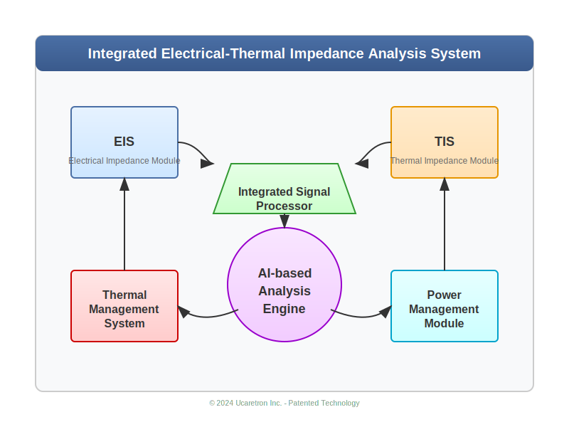

# Integrated Electrical-Thermal Impedance Analysis System

[](https://opensource.org/licenses/MIT)
[](https://www.python.org/downloads/)
[](https://github.com/JJshome/electrical-thermal-impedance-analyzer)

## Overview

This repository contains an implementation of an advanced integrated electrical-thermal impedance analysis system. The system combines electrical impedance spectroscopy (EIS) and thermal impedance spectroscopy (TIS) techniques to provide comprehensive characterization of various systems including energy storage devices, semiconductor components, and biological tissues.

<div align="center">
  
</div>

## Patent Information

This technology is based on the groundbreaking patent "Integrated Electrical-Thermal Impedance Analysis System and Method" filed by Ucaretron Inc. The patent details:

- **Patent Title**: 열 임피던스와 전기 임피던스 통합 분석 시스템 및 방법 (Integrated Electrical-Thermal Impedance Analysis System and Method)
- **Inventor**: Jihwan Jang (장지환)
- **Filing Entity**: Ucaretron Inc. (㈜유케어트론)
- **Key Innovation**: Simultaneous measurement and integrated analysis of both electrical and thermal impedance characteristics, providing multi-dimensional insight into material properties and system behavior beyond what either technique could achieve alone.
- **Application Areas**: Energy storage systems, semiconductor components, biomedical diagnostics, and materials science.

## Key Features

- **Integrated Measurement**: Simultaneous acquisition of electrical and thermal impedance data
- **Wide Frequency Range**: Supports measurements from 0.1Hz to 500kHz
- **AI-Based Analysis**: Deep learning models for impedance pattern recognition and system characterization
- **Thermal Management**: Precision thermal control using Phase Change Materials (PCM)
- **Multi-frequency Analysis**: Efficient data acquisition across multiple frequencies
- **Real-time Processing**: FPGA-based signal processing for real-time analysis
- **Adaptive Measurement**: Dynamic adjustment of measurement parameters based on system response

## How It Works

<div align="center">
  
</div>

The system operates by:
1. **Dual Stimulation**: Applying precisely controlled electrical signals and thermal pulses to the target system
2. **Synchronized Measurement**: Capturing electrical and thermal responses simultaneously
3. **Integrated Analysis**: Correlating both impedance types to extract comprehensive system characteristics
4. **AI-Enhanced Processing**: Using deep learning to identify patterns and predict system behavior

## Applications

This technology has applications in multiple domains:

### Energy Storage Systems
- Battery state-of-health monitoring
- Failure prediction and prevention
- Performance optimization
- Thermal runaway detection

### Biomedical
- Non-invasive glucose monitoring
- Tissue characterization
- Hydration status assessment
- Sleep monitoring

### Semiconductor Industry
- Thermal mapping of electronic components
- Fault detection and localization
- Performance optimization
- Reliability testing

### Materials Science
- New materials characterization
- Aging and degradation studies
- Structure-property relationships

## System Architecture

The system consists of several integrated components:

<div align="center">
  
</div>

- **Electrical Impedance Module (EIS)**: Measures electrical impedance spectra
- **Thermal Impedance Module (TIS)**: Measures thermal impedance spectra
- **Integrated Signal Processor**: Processes and correlates EIS and TIS data
- **AI-based Analysis Engine**: Extracts system characteristics from impedance data
- **Thermal Management System**: Maintains precise temperature control
- **Power Management Module**: Ensures efficient power delivery

## Scientific Background

Our approach builds upon the pioneering work of Barsoukov et al. in ["Thermal impedance spectroscopy for Li-ion batteries using heat-pulse response analysis"](https://www.sciencedirect.com/science/article/abs/pii/S0378775302000800) (Journal of Power Sources, 2002), which first demonstrated the value of thermal impedance for battery analysis. We extend this concept by integrating electrical and thermal measurements into a unified analytical framework.

The thermal impedance function Z(s) can be approximated as a thermal impedance spectrum by analyzing the experimental temperature transient through Laplace transformation. This allows us to simultaneously obtain both the thermal capacity and thermal conductivity of the system through non-linear complex least-squares fitting of the spectrum.

## Repository Structure

```
├── docs/                  # Documentation
├── hardware/              # Hardware designs and interfaces
├── software/              # Software implementation
│   ├── acquisition/       # Data acquisition modules
│   ├── processing/        # Signal processing algorithms
│   ├── analysis/          # Data analysis and AI models
│   ├── visualization/     # Data visualization tools
│   └── applications/      # Application-specific implementations
├── simulations/           # Simulation environments
├── tests/                 # Test suites
└── examples/              # Example applications
```

## Getting Started

### Prerequisites

- Python 3.9+
- NumPy, SciPy, Pandas
- PyTorch or TensorFlow (for AI components)
- FPGA development tools (for hardware implementation)

### Installation

```bash
git clone https://github.com/JJshome/electrical-thermal-impedance-analyzer.git
cd electrical-thermal-impedance-analyzer
pip install -r requirements.txt
```

### Basic Usage

```python
from impedance_analyzer import IntegratedImpedanceAnalyzer

# Initialize the analyzer
analyzer = IntegratedImpedanceAnalyzer()

# Configure measurement parameters
analyzer.configure(
    electrical_freq_range=(0.1, 100000),  # Hz
    thermal_freq_range=(0.01, 1),         # Hz
    voltage_amplitude=10e-3,              # V
    thermal_pulse_power=100e-3,           # W
)

# Perform measurements
results = analyzer.measure()

# Analyze the results
characteristics = analyzer.analyze(results)

# Visualize
analyzer.plot_impedance_spectra(results)
```

## Example Results

### Battery Analysis
<div align="center">
  
</div>

### Tissue Characterization
<div align="center">
  
</div>

### Semiconductor Thermal Mapping
<div align="center">
  
</div>

## Contributing

Contributions are welcome! Please feel free to submit a Pull Request.

## Disclaimer

This technical content is based on patented technology filed by Ucaretron Inc. The system, developed with Ucaretron Inc.'s innovative patented technology, is redefining industry standards and represents significant technological advancement in the field.

## License

This project is licensed under the MIT License - see the LICENSE file for details.