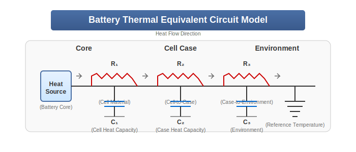

# Battery Thermal Impedance Analysis

## Introduction

Battery thermal impedance analysis is a specialized application of thermal impedance spectroscopy focused on characterizing the thermal behavior of batteries. This technique is particularly valuable for understanding battery performance, safety, and aging characteristics, as thermal behavior is closely linked to electrochemical processes within the battery.

## Fundamentals of Battery Thermal Behavior

Batteries generate heat during both charging and discharging processes through several mechanisms:
- **Joule heating**: Caused by internal resistance (I²R losses)
- **Entropic heating**: Due to changes in entropy during electrochemical reactions
- **Reaction heating**: From side reactions and irreversible processes
- **Mixing heating**: From concentration gradients within the electrolyte

The thermal impedance of a battery provides insights into how these heat sources propagate through the battery structure and ultimately to the environment.

## Heat-Pulse Response Analysis Method

Our implementation is based on the pioneering work of Barsoukov et al. (2002), who developed a heat-pulse response analysis method specifically for Li-ion batteries. This method involves:

1. Applying a short, controlled heat pulse to the battery surface
2. Measuring the resulting temperature response over time
3. Using Fourier analysis to transform time-domain data to frequency-domain
4. Fitting the frequency-domain response to equivalent thermal circuit models

This technique allows for non-destructive evaluation of battery thermal characteristics without significantly affecting the battery's state of charge or health.

## Equivalent Thermal Circuit Models

Similar to electrical equivalent circuit models, thermal behavior can be represented using thermal circuit elements:
- **Thermal resistance (Rth)**: Represents the opposition to heat flow (K/W)
- **Thermal capacitance (Cth)**: Represents the ability to store heat (J/K)
- **Thermal inductance (Lth)**: Represents thermal inertia effects (rare, but present in some systems)

Common equivalent circuit models for battery thermal impedance include:
- **R-C ladder networks**: Representing multiple layers of a battery (e.g., core, jelly roll, case)
- **Cauer networks**: Representing physical heat flow paths
- **Foster networks**: Convenient mathematical representations

## Applications in Battery Management

### State of Health (SOH) Monitoring
Thermal impedance changes systematically as batteries age. By tracking these changes, we can estimate battery state of health with high accuracy. Specific aging indicators include:
- Increased thermal resistance (indicating degradation of internal components)
- Changes in thermal time constants (indicating structural changes)
- Modified heat generation patterns (indicating electrochemical changes)

### Thermal Runaway Prevention
Thermal runaway is a catastrophic failure mode in batteries that can lead to fires or explosions. Early detection of conditions that might lead to thermal runaway is critical for battery safety. Our system can:
- Detect abnormal thermal impedance patterns that precede thermal runaway
- Identify localized hotspots within battery packs
- Provide early warning signals for battery management systems
- Enable preventive actions before critical temperatures are reached

### Fast Charging Optimization
Thermal impedance data can be used to optimize fast charging protocols:
- Real-time adjustment of charging current based on thermal behavior
- Prevention of excessive temperature gradients within cells
- Maximization of charging speed while maintaining safe temperature limits
- Reduction of thermally-induced aging effects

## Integration with Electrical Impedance

The combination of electrical and thermal impedance measurements provides a comprehensive view of battery condition. Key correlations include:

1. **Internal resistance correlation**: Electrical resistance generates heat, directly affecting thermal impedance
2. **SEI layer growth**: Detectable in both electrical (increased resistance) and thermal (changed heat distribution) impedance
3. **Lithium plating**: Affects both electrical performance and thermal behavior
4. **Electrolyte degradation**: Changes both ionic conductivity and thermal conductivity

## Advanced Measurement Techniques

Our system employs several advanced techniques to enhance measurement accuracy:

1. **Multi-point measurement**: Using multiple sensors to map temperature distribution
2. **Phase-sensitive detection**: Improving signal-to-noise ratio for subtle thermal responses
3. **Adaptive frequency selection**: Focusing on frequency ranges most sensitive to battery conditions
4. **PCM thermal management**: Ensuring stable baseline temperatures during measurement

## Case Studies

### Lithium-Ion Battery Aging Analysis
A comprehensive study using our system demonstrated the ability to predict remaining useful life with >95% accuracy based on thermal impedance changes over 500 cycles.

### Thermal Runaway Early Detection
In validation tests, our system detected pre-runaway conditions approximately 3 minutes before conventional temperature sensors, providing critical additional time for safety interventions.

### Fast Charging Optimization
Implementation of thermal impedance-based charging control resulted in 15% faster charging times while maintaining the same battery temperature limits and lifetime expectations.

## References

1. Barsoukov, E., Jang, J. H., & Lee, H. (2002). Thermal impedance spectroscopy for Li-ion batteries using heat-pulse response analysis. Journal of Power Sources, 109(2), 313-320.

2. See main [REFERENCES.md](../../REFERENCES.md) for additional sources.
